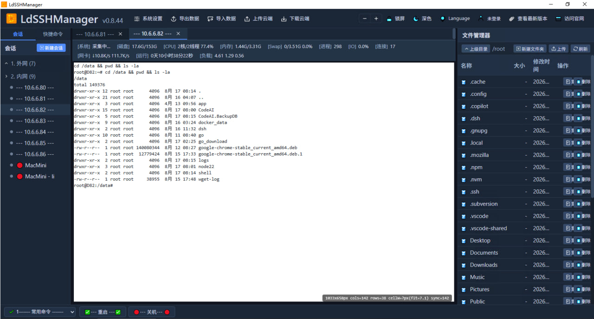
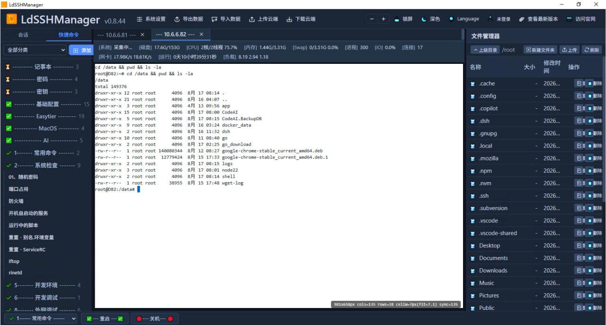
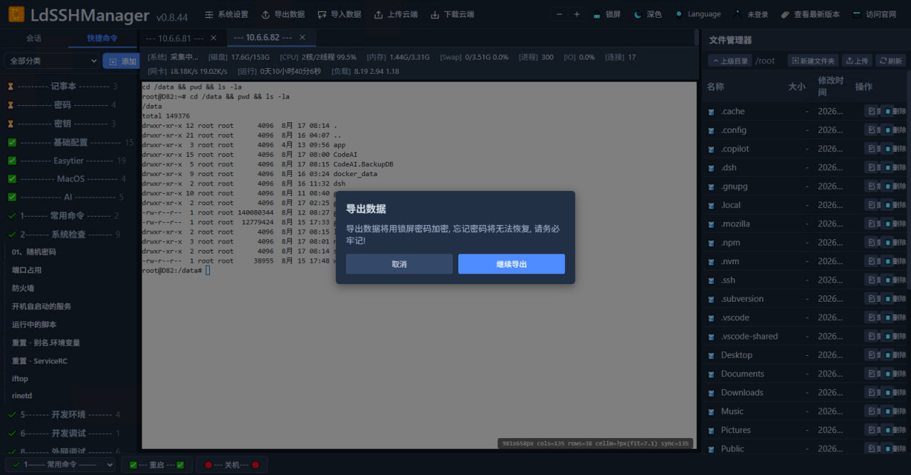
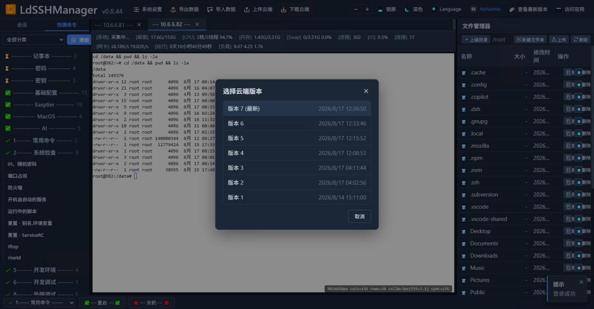
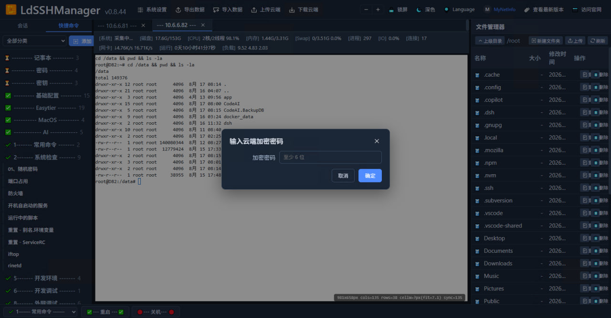
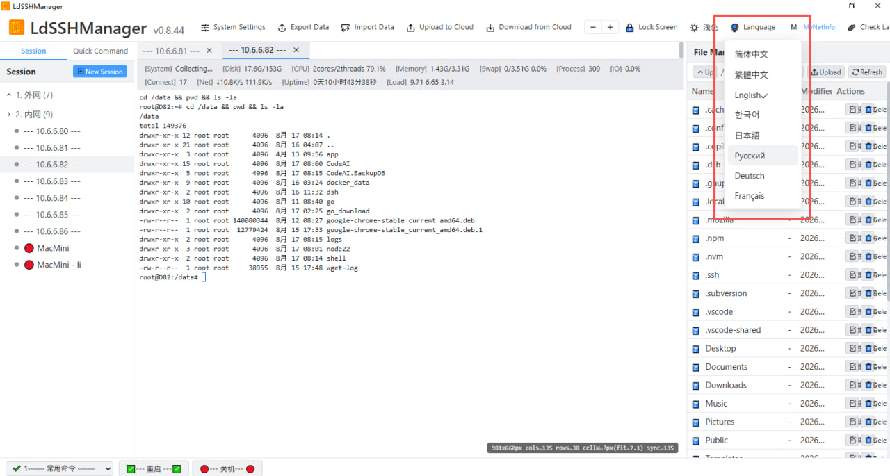
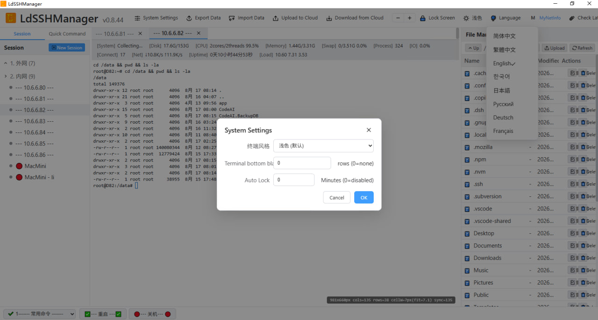

<!-- Language switch -->
[**简体中文**](README.md) | [English](README.en.md)

<div align="center">

# LdSSHManager

**Open source · Customizable · Your data, encrypted & protected — an all-in-one desktop SSH session manager**

**🔗 Source code**: https://github.com/MyNetInfo/LdSSHManager  
**🌐 Website (download)**: https://www.gxlidang.com/soft/ldsshmanager

Session tree · Multi-tab terminal · Quick commands · SFTP · Cloud sync · Vault encryption, built for multi-host ops and remote development

[](#)
[](#)
[](#)
[](#)
[](#)
[](LICENSE)

[Features](#-core-features) · [Screenshots](#-screenshots) · [Why It's Safe](#-why-you-can-trust-it-open-source--security) · [Download & Install](#-download--install) · [Build & Development](#-build--development) · [Feedback](#-feedback)

</div>

---

## 📖 Overview

**LdSSHManager** is a cross-platform desktop SSH session management tool (**Windows 10/11, Linux x64, and macOS on Apple Silicon**) built with **Wails v2 + Go + Vue 3**. It brings together the most frequent multi-host ops workflows — **session grouping & one-click connect, a high-performance xterm terminal, one-click quick commands, remote file browsing/editing, multi-device config sync, and encrypted data protection** — into a single lightweight, native-feeling desktop application, so you can stop juggling between terminals, PuTTY, WinSCP and notepads.

From day one it is built on three principles:

- 🧡 **Open source**: full source code is public on GitHub — auditable, reproducible, no black box, no backdoors;
- 🛠️ **Customizable**: an open tech stack (Go + Vue 3 + xterm) lets you re-skin, extend, and integrate it into your own systems;
- 🔐 **Security guaranteed**: local data is encrypted at rest, cloud sync is end-to-end encrypted — whether you use it standalone or sync to the cloud, your credentials and data belong to you alone.

- Source code: <https://github.com/MyNetInfo/LdSSHManager>
- Website (download): <https://www.gxlidang.com/soft/ldsshmanager>
- Current version: **v0.8.46**

---

## ✨ Core Features

### Sessions & Connections
- 🌳 **Session tree with groups**: External / Internal / custom groups; double-click to connect; import & export.
- ⚡ **Two-step connect**: a tab opens instantly in `connecting` state, SSH handshake runs in the background, status flips to `connected` / `failed` — no waiting.
- 🔁 **SFTP cd sync**: run `cd` in the terminal and the file manager follows automatically.
- 🌐 **Proxy support**: connect to SSH through proxies for restricted networks.

### Terminal Experience
- 🖥️ **xterm + WebGL renderer**: smoother, crisper TUI redraws (top / htop / vim); real PTY size adapts to window resizing.
- 📑 **Multi-tab parallel**: manage multiple servers at once, independently.
- ⌨️ **Quick command library**: categorized command snippets, one-click execute, optional auto-Enter.
- 🔄 **Disconnect protection**: input freezes after a drop to stop `send error` spam, with a clear `[connection closed]` notice.

### Files & Sync
- 📁 **SFTP file manager**: browse, upload/download, rename, delete.
- ☁️ **Cloud sync (end-to-end encrypted)**: sessions / quick commands / configs encrypted-uploaded to the cloud, shared across devices, with version history & conflict handling.
- 💾 **Encrypted local storage**: full-database SQLCipher (AES-256) encryption, key derived from your lock-screen password; binary attachments live in `data/`.

### Security & UX
- 🔒 **Lock screen**: auto-lock on idle (configurable in System Settings, 0=disabled).
- 🗝️ **Encrypted export / import**: full-data encrypted backup & migration.
- 📊 **Real-time server status panel**: CPU / memory / disk / process / network / uptime etc. (SecureCRT-style).
- 🌗 **Multiple themes**: light / dark, free to switch.
- 🌍 **Multi-language UI**: Simplified Chinese / Traditional Chinese / English / Korean / Japanese / Russian / German / French.
- 🔌 **Self-installing build env (dev)**: `INIT.bat` auto-detects/installs Go / Node / MSYS2-GCC / NSIS / Wails CLI; `MAKE.bat` builds with normal user rights.

---

## 📸 Screenshots

### 🖥️ Main UI — Session tree + Terminal + File Manager
Session tree grouped by "External / Internal" on the left, one-click connect; multi-tab xterm terminal in the middle running real commands; SFTP file manager browsing `/root` on the right; bottom status bar shows remote system / disk / CPU / memory / process / IO / connection / network / uptime / load in real time (SecureCRT-style info bar).


### ⌨️ Quick Command Panel
Left "Quick Command" panel lists commands by category (base config / password / key / Easytier / MacOS / AI / system check / firewall / port usage…), one-click execution in the terminal.


### 📤 Export Data (encrypted with lock-screen password)
"Export Data" makes it clear: the export **is encrypted with your lock-screen password** — if you lose the password, recovery is impossible, so remember it well.


### ☁️ Cloud Version Picker
When downloading / syncing, pick a historical version (`版本 1 ~ 版本 7 (最新)`) with timestamps for rollback and conflict resolution.


### 🔐 Cloud Encryption Password
Cloud sync requires an **encryption / decryption password** (≥ 6 characters): data is encrypted locally before upload — the cloud only stores ciphertext; the same password decrypts on download.


### 🌐 Language Switcher
Top-bar **Language** dropdown switches among 7 languages in one click (English / 繁體中文 / 한국어 / 日本語 / Русский / Deutsch / Français — the label is always in English so you can always find it).


### ⚙️ System Settings
Clean "System Settings" dialog: **Terminal Style** (light / dark / custom), **Terminal bottom blank rows**, **Auto Lock** minutes (0 = disabled).


---

## 🛡️ Why You Can Trust It (Open Source & Security)

> **TL;DR: local data is locked by your lock-screen password; cloud data is protected by an independent encryption password — end to end. Nothing sensitive ever touches disk or the wire in plaintext.**

### 1️⃣ Open source = transparent & auditable
The full source is public at <https://github.com/MyNetInfo/LdSSHManager>. You can:
- **Audit line by line**: encryption, storage and network behavior are all in the open — no "we don't know what it uploaded" black box;
- **Build it yourself**: `INIT.bat` + `MAKE.bat` produce a byte-comparable binary against the official release;
- **Customize it freely**: re-skin the UI, add features, integrate with your internal systems.

### 2️⃣ Lock-screen password = the only key to your local data
- Your lock-screen password **derives the local database encryption key** (PBKDF2 → SQLCipher / AES-256);
- The database is **fully encrypted**: connections, credentials, quick commands, and settings are all stored as ciphertext;
- **No password, no access** — even if the DB file is copied away, it's just unreadable bytes;
- Export / import backups are encrypted with the same key, so backup files are safe to copy and store anywhere.

### 3️⃣ Cloud sync = independent "encryption / decryption password", end-to-end
- Cloud sync uses a **password independent from the lock-screen password** (≥ 6 characters);
- **Encrypted locally before upload** — the cloud server receives and stores only ciphertext; **decrypted locally on download** — the cloud cannot read your connection config;
- Two different keys for local and cloud, so leaking either one does not compromise the other;
- Forgetting the encryption password makes the cloud data **unrecoverable** — exactly what end-to-end encryption is supposed to be.

### 4️⃣ Standalone or synced — security never compromises
| Usage | Where the data goes | Protection |
|---|---|---|
| **Local only** | Everything stays encrypted on your machine | SQLCipher full-DB encryption + key derived from lock-screen password + optional auto-lock |
| **Synced to cloud** | Sessions / quick commands / configs, encrypted | End-to-end encryption (encrypt before upload / decrypt on download); cloud only sees ciphertext |
| **Export / backup** | Local backup files | Encrypted with lock-screen password; safe to copy & store off-site |

---

## 🏗️ Tech Stack

| Layer | Choice | Notes |
|---|---|---|
| Desktop framework | **Wails v2** | Go + Web, native window (Windows: WebView2 / Linux: WebKit2GTK / macOS: WKWebView) |
| Backend | **Go 1.25+** | Wails bindings, SSH client (CGO with go-sqlcipher), concurrent pumps |
| Frontend | **Vue 3 (TypeScript) + Vite** | Componentized, type-safe |
| Terminal | **xterm.js + WebGL renderer** | High-performance TUI rendering |
| Database | **SQLite + SQLCipher (AES-256)** | Local encrypted DB, key derived from lock-screen password |
| IPC | Wails bindings + Go channels | Front-end ↔ back-end events and calls |

---

## 📦 Download & Install

### Get it

| Channel | Link | Notes |
|---|---|---|
| 🌐 **Website** | <https://www.gxlidang.com/soft/ldsshmanager> | Download portable / installer builds |
| 🐙 **GitHub** | <https://github.com/MyNetInfo/LdSSHManager> | Source code, Issues, Releases |

### Packages

| Package | File | Use case |
|---|---|---|
| 🟢 **Windows Portable** | `LdSSHManager-x64.exe` | No installation, double-click to run — great for ad-hoc use or USB drives |
| 📦 **Windows NSIS Installer** | `LdSSHManager-Install-x64.exe` | Standard Windows installer: custom install dir, desktop/Start-menu shortcuts, uninstaller |
| 🐧 **Linux build** | `LdSSHManager-linux-x64` | Executable (`chmod +x` then run); requires GTK3 / WebKit2GTK desktop deps |
| 🍎 **macOS (Apple Silicon)** | `LdSSHManager-macos-arm64.dmg` | Disk image (M-series; unsigned — first launch: right-click → Open) |
| 🍎 **macOS (Intel)** | `LdSSHManager-macos-x64.dmg` | Disk image (Intel Mac; unsigned — first launch: right-click → Open) |

> If Windows warns "Unknown publisher", click **More info** → **Run anyway** (no commercial code-signing certificate is in use; verify against the source or build it yourself).
>
> **Auto build**: every push to the `main` branch triggers GitHub Actions to build **Windows (portable + installer) and Linux** and publish them to the `latest` release on [Releases](https://github.com/MyNetInfo/LdSSHManager/releases) (updated on every push).

### System requirements

- **OS**:
  - **Windows** 10 / 11 (x64)
  - **Linux** x64 (requires GTK3, WebKit2GTK 4.1 and other desktop deps; e.g. `sudo apt install libgtk-3-dev libwebkit2gtk-4.1-dev`)
  - **macOS** Apple Silicon (M-series, macOS 12+) and Intel (macOS 12+); unsigned — first launch: right-click → Open
- **WebView2 Runtime**: Windows only — pre-installed on Win11; the **installer** embeds it for Win10; the portable build prompts to install it once on first launch
- **Screen resolution**: ≥ 1280×720 recommended

---

## 🛠️ Build & Development

Developer environment requirements are documented in [AGENTS.md](./AGENTS.md).

### Source layout

```
LdSSHManager/
├── app.go               # Wails bindings
├── internal/            # Go backend (store / vault / sshclient)
├── frontend/            # Vue3 frontend
│   └── src/components/  # Main UI components
├── MAKE.bat             # Build script (normal user rights)
├── INIT.bat             # Environment detect + install (run once per machine, needs admin)
├── DEV.bat              # wails dev hot reload
├── main.go              # Wails entry
├── bump_version.mjs     # Auto-bump version before each SVN commit
└── ___docs___/CHANGES.md # Major-change log
```

### Quick start

```powershell
# 1. First time / new machine: install build environment manually
#    (double-click INIT.bat or run it in an admin cmd — one UAC prompt)
INIT.bat

# 2. Build (normal user, no admin required)
MAKE.bat
```

`MAKE.bat` automatically: updates SVN → composes PATH → checks environment → runs `wails build -platform windows/amd64 -nsis -webview2 embed` → moves the artifacts to the project root.

---

## 🌐 Internationalization

- 🇨🇳 Simplified Chinese (default) · 🇹🇼 Traditional Chinese · 🇺🇸 English · 🇰🇷 Korean · 🇯🇵 Japanese · 🇷🇺 Russian · 🇩🇪 German · 🇫🇷 French

The top-bar **Language** button (always labeled in English) switches instantly; translation files live in `frontend/src/i18n.ts` — new language PRs are welcome.

---

## ❓ FAQ

<details>
<summary><b>Windows warns "Unknown publisher" after download — what do I do?</b></summary>
Expected: no commercial code-signing certificate is in use. Click **More info** → **Run anyway**. You can also grab the source and build it yourself, or verify hashes against a GitHub Actions artifact.
</details>

<details>
<summary><b>I forgot my lock-screen password — can I recover my data?</b></summary>
**No, it is unrecoverable** — and that is the point: the database key is derived from your password; losing it means the data cannot be decrypted. Please:
1. Regularly use **Export Data** to make an encrypted backup (re-importable with the same lock-screen password);
2. Store the password in a password manager.
</details>

<details>
<summary><b>I forgot my cloud "encryption / decryption" password?</b></summary>
Also **unrecoverable** — it is independent of the lock-screen password; the cloud only holds ciphertext, so nobody can decrypt it without the password. Keep it in a password manager.
</details>

<details>
<summary><b>Win10 asks to install WebView2 on first launch?</b></summary>
The **NSIS installer** embeds WebView2 — nothing extra needed. The portable build prompts to install it once (~100 MB, one-time).
</details>

<details>
<summary><b>I want to fork / customize — where do I start?</b></summary>
See [Build & Development](#-build--development) and the source layout. Key UI components live in `frontend/src/components/`, backend in `internal/` — Fork / PR / Issues welcome.
</details>

---

## 🔗 Links

- 🐙 **Source code**: <https://github.com/MyNetInfo/LdSSHManager>
- 🌐 **Website (download)**: <https://www.gxlidang.com/soft/ldsshmanager>
- 🐛 **Feedback**: GitHub Issues / website comments

---

## 🤝 Acknowledgments

- Terminal: [xterm.js](https://xtermjs.org/) & [xterm-webgl](https://github.com/xtermjs/xterm.js)
- Desktop framework: [Wails](https://wails.io/)
- Encryption: [SQLCipher](https://www.zetetic.net/sqlcipher/)

---

## 📄 License

This project is licensed under the **MIT License** — see the [`LICENSE`](LICENSE) file (Copyright © 2026 MyNetInfo).

> ⚠️ This project is provided "as is". Open source means transparency and auditability — please evaluate risks and comply with local laws before use.

---

<sub align="center">Open source · Transparent · Customizable · Made for SSH lovers 💙</sub>
